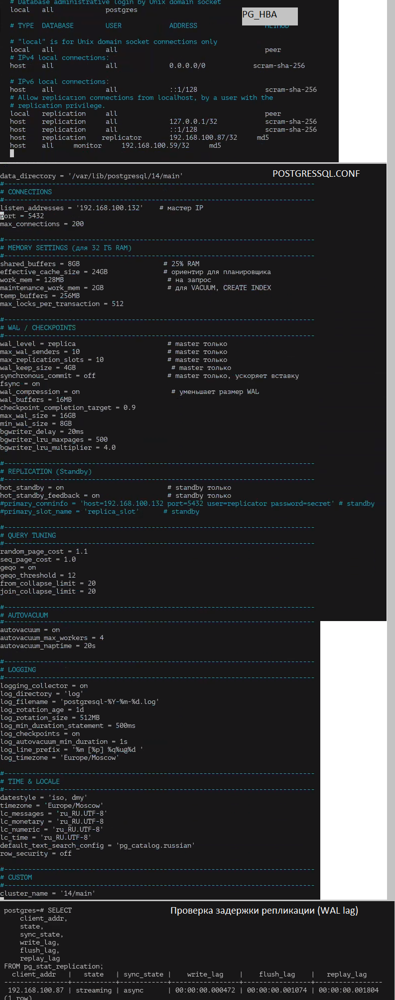
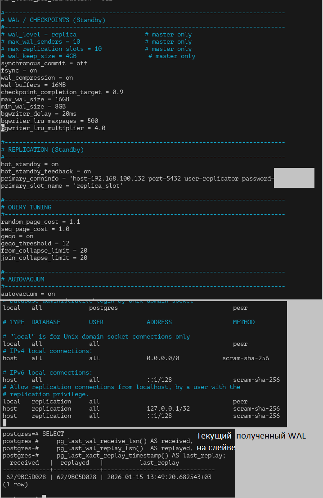

# Домашнее задание к занятию "Репликация и масштабирование. Часть 1"- Протопопов Николай Андреевич

### Инструкция по выполнению домашнего задания

   1. Сделайте `fork` данного репозитория к себе в Github и переименуйте его по названию или номеру занятия, например, https://github.com/имя-вашего-репозитория/git-hw или  https://github.com/имя-вашего-репозитория/7-1-ansible-hw).
   2. Выполните клонирование данного репозитория к себе на ПК с помощью команды `git clone`.
   3. Выполните домашнее задание и заполните у себя локально этот файл README.md:
      - впишите вверху название занятия и вашу фамилию и имя
      - в каждом задании добавьте решение в требуемом виде (текст/код/скриншоты/ссылка)
      - для корректного добавления скриншотов воспользуйтесь [инструкцией "Как вставить скриншот в шаблон с решением](https://github.com/netology-code/sys-pattern-homework/blob/main/screen-instruction.md)
      - при оформлении используйте возможности языка разметки md (коротко об этом можно посмотреть в [инструкции  по MarkDown](https://github.com/netology-code/sys-pattern-homework/blob/main/md-instruction.md))
   4. После завершения работы над домашним заданием сделайте коммит (`git commit -m "comment"`) и отправьте его на Github (`git push origin`);
   5. Для проверки домашнего задания преподавателем в личном кабинете прикрепите и отправьте ссылку на решение в виде md-файла в вашем Github.
   6. Любые вопросы по выполнению заданий спрашивайте в чате учебной группы и/или в разделе “Вопросы по заданию” в личном кабинете.
   
Желаем успехов в выполнении домашнего задания!
   
### Дополнительные материалы, которые могут быть полезны для выполнения задания

1. [Руководство по оформлению Markdown файлов](https://gist.github.com/Jekins/2bf2d0638163f1294637#Code)

---
#Комманды для работы с GIT
1. git clone https://github.com/Nikolay-Protopopov/homework-zabbix.git
2. cd homework-zabbix 
3. mkdir screenshots
4. git add README.md screenshots/ 
5. git commit -m "Добавлены скриншоты и обновлен README"
6. git remote set-url origin "https://мой токен@github.com/Nikolay-Protopopov/homework-zabbix.git"
7. git push origin main

### Задание 1
На лекции рассматривались режимы репликации master-slave, master-master, опишите их различия.

Ответить в свободной форме.
1. Репликация Master–Slave
Суть

Master — основной сервер
→ принимает запись и чтение

Slave — реплика
→ принимает только чтение, данные копируются с master

Client → Master → Slave
         (write)   (read)

Особенности

Все изменения данных происходят только на master

Slave синхронизируется:

асинхронно (чаще всего)

синхронно (реже, дороже по задержкам).
2. Репликация Master–Master
Суть

Оба сервера — master

Запись возможна на каждом

Серверы реплицируют данные друг другу

Client → Master A ↔ Master B ← Client
        (write)     (write)

Особенности

Каждый узел может принимать записи

Требуется механизм:

разрешения конфликтов

уникальности ключей

контроля циклической репликации

### Задание 2
Выполните конфигурацию master-slave репликации, примером можно пользоваться из лекции.

Приложите скриншоты конфигурации, выполнения работы: состояния и режимы работы серверов.

### Master

### Slave

