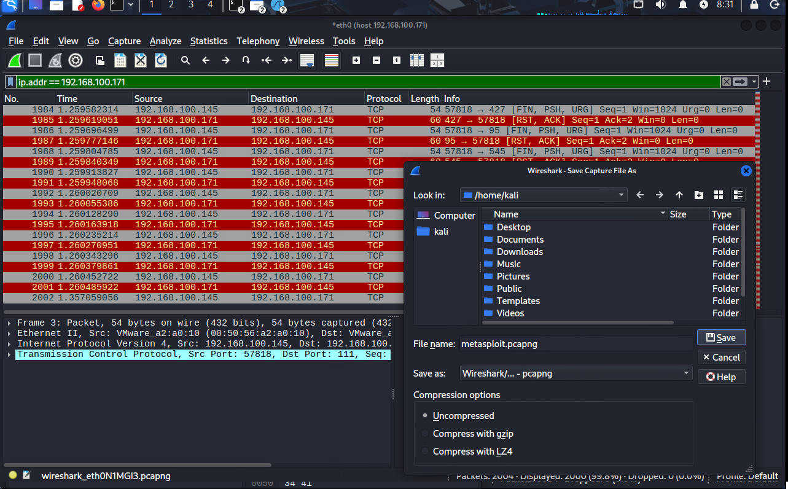
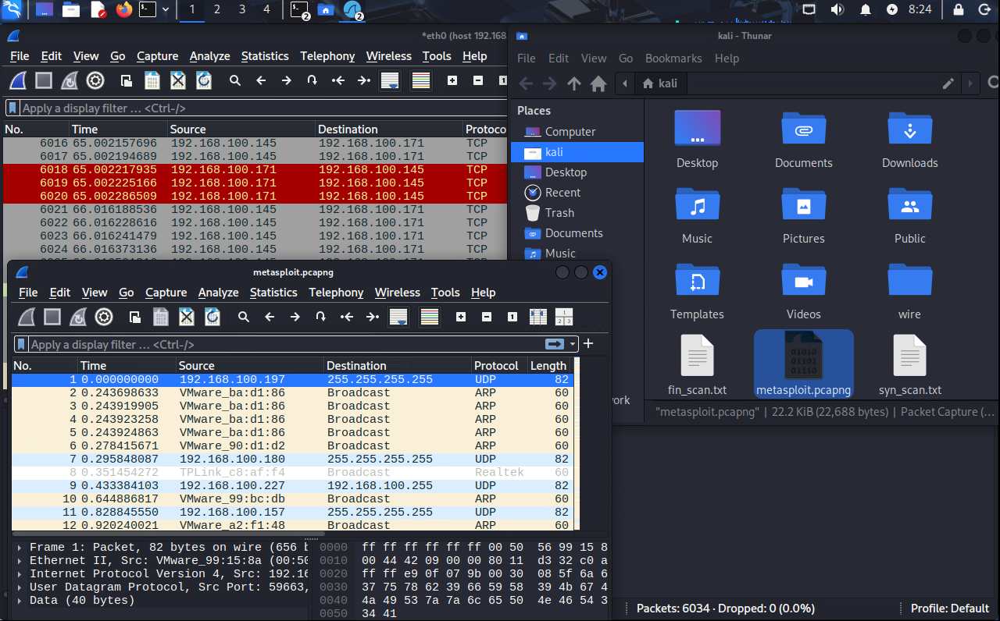

# Домашнее задание к занятию «Уязвимости и атаки на информационные системы» - Протопопов Николай Андреевич

### Инструкция по выполнению домашнего задания

   1. Сделайте `fork` данного репозитория к себе в Github и переименуйте его по названию или номеру занятия, например, https://github.com/имя-вашего-репозитория/git-hw или  https://github.com/имя-вашего-репозитория/7-1-ansible-hw).
   2. Выполните клонирование данного репозитория к себе на ПК с помощью команды `git clone`.
   3. Выполните домашнее задание и заполните у себя локально этот файл README.md:
      - впишите вверху название занятия и вашу фамилию и имя
      - в каждом задании добавьте решение в требуемом виде (текст/код/скриншоты/ссылка)
      - для корректного добавления скриншотов воспользуйтесь [инструкцией "Как вставить скриншот в шаблон с решением](https://github.com/netology-code/sys-pattern-homework/blob/main/screen-instruction.md)
      - при оформлении используйте возможности языка разметки md (коротко об этом можно посмотреть в [инструкции  по MarkDown](https://github.com/netology-code/sys-pattern-homework/blob/main/md-instruction.md))
   4. После завершения работы над домашним заданием сделайте коммит (`git commit -m "comment"`) и отправьте его на Github (`git push origin`);
   5. Для проверки домашнего задания преподавателем в личном кабинете прикрепите и отправьте ссылку на решение в виде md-файла в вашем Github.
   6. Любые вопросы по выполнению заданий спрашивайте в чате учебной группы и/или в разделе “Вопросы по заданию” в личном кабинете.
   
Желаем успехов в выполнении домашнего задания!
   
### Дополнительные материалы, которые могут быть полезны для выполнения задания

1. [Руководство по оформлению Markdown файлов](https://gist.github.com/Jekins/2bf2d0638163f1294637#Code)

---
#Комманды для работы с GIT
1. git clone https://github.com/Nikolay-Protopopov/homework-zabbix.git
2. cd homework-zabbix 
3. mkdir screenshots
4. git add README.md screenshots/ 
5. git commit -m "Добавлены скриншоты и обновлен README"
6. git remote set-url origin "https://мой токен@github.com/Nikolay-Protopopov/homework-zabbix.git"
7. git push origin main

### Задание 1
Скачайте и установите виртуальную машину Metasploitable: https://sourceforge.net/projects/metasploitable/.

Это типовая ОС для экспериментов в области информационной безопасности, с которой следует начать при анализе уязвимостей.

Просканируйте эту виртуальную машину, используя nmap.

Попробуйте найти уязвимости, которым подвержена эта виртуальная машина.

Сами уязвимости можно поискать на сайте https://www.exploit-db.com/.

Для этого нужно в поиске ввести название сетевой службы, обнаруженной на атакуемой машине, и выбрать подходящие по версии уязвимости.

Ответьте на следующие вопросы:

Какие сетевые службы в ней разрешены?
Какие уязвимости были вами обнаружены? (список со ссылками: достаточно трёх уязвимостей)
Приведите ответ в свободной форме.

Результаты сканирования и полученых уязвимостей видно на скриншоте. 
vsftpd 2.3.4 - Backdoor Command Execution 
https://www.exploit-db.com/exploits/49757

PostgreSQL 8.2/8.3/8.4 - UDF for Command Execution 
https://www.exploit-db.com/exploits/7855

MySQL 5.0.x - IF Query Handling Remote Denial of Service
https://www.exploit-db.com/exploits/30020

### Задание 2
Проведите сканирование Metasploitable в режимах SYN, FIN, Xmas, UDP.

Запишите сеансы сканирования в Wireshark.

Ответьте на следующие вопросы:

Чем отличаются эти режимы сканирования с точки зрения сетевого трафика?
Как отвечает сервер?
Приведите ответ в свободной форме.
TARGET="ip Metasploitable"
Запускаем Wireshark с сохранением в файл
В интерфейсе программы в строке задал параметр ip.addr== при запуске отслеживания он спрашивает нужно ли сохранять и куда. 

Далее в терминале вводил комманды.
sudo nmap -sS -p 1-1000 $TARGET -oN syn_scan.txt
sudo nmap -sF -p 1-1000 $TARGET -oN fin_scan.txt
sudo nmap -sX -p 1-1000 $TARGET -oN xmas_scan.txt
sudo nmap -sU -p 1-1000 $TARGET -oN udp_scan.txt

Ответы на вопросы
Вопрос 1: Чем отличаются эти режимы сканирования с точки зрения сетевого трафика?
Тип сканирования	TCP Флаги	Поведение	Обнаружимость
SYN (-sS)	SYN=1, ACK=0	Полуоткрытое соединение. Отправляет SYN, получает SYN-ACK (открыт) или RST (закрыт)	Средняя. Может быть обнаружено IDS
FIN (-sF)	FIN=1	Отправляет FIN пакет. Закрытый порт отвечает RST, открытый - игнорирует	Стелс. Может обойти некоторые брандмауэры
Xmas (-sX)	FIN=1, URG=1, PSH=1	Все три флага установлены. Поведение как у FIN сканирования	Более заметное из-за необычных флагов
UDP (-sU)	Нет TCP (UDP)	Отправляет пустой UDP пакет. Ответ ICMP Port Unreachable если порт закрыт	Очень медленное, легко обнаруживаемое
С точки зрения трафика:

SYN: Нормальные SYN пакеты, похожи на начало TCP handshake

FIN: Пакеты с FIN флагом, похожи на завершение соединения

Xmas: Необычные пакеты с тремя установленными флагами

UDP: UDP датаграммы без данных

Вопрос 2: Как отвечает сервер?
На Metasploitable:
Для открытых TCP портов (например, 22 - SSH, 80 - HTTP):

SYN scan: → SYN-ACK ←

FIN scan: → Нет ответа ← (или может RST на некоторых системах)

Xmas scan: → Нет ответа ←

UDP scan: → Нет ответа ← (если это TCP порт)

Для закрытых TCP портов:

SYN scan: → RST ←

FIN scan: → RST ←

Xmas scan: → RST ←

UDP scan: → ICMP Port Unreachable (тип 3, код 3) ←

Для фильтруемых портов:

Все TCP scans: → Нет ответа или ICMP запрещено ←

UDP scan: → Нет ответа ←
